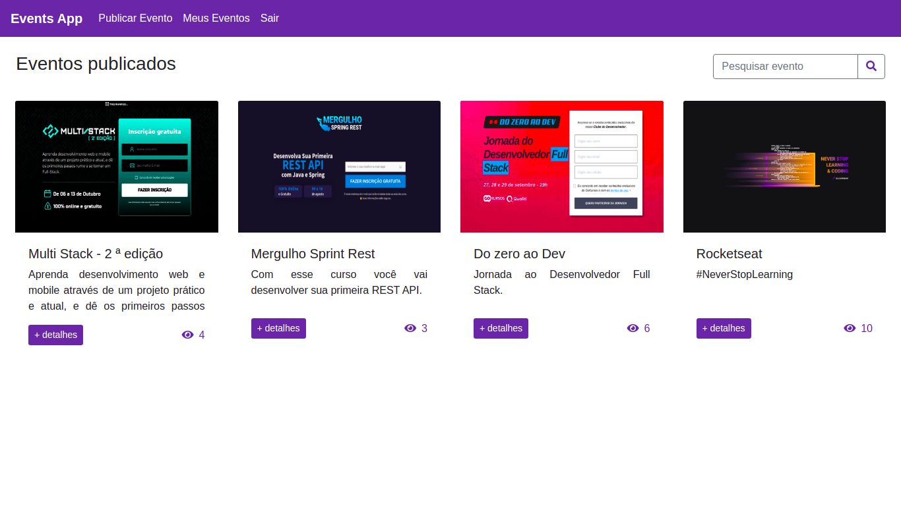

<h1 align="center">
    
</h1>

<hr>

## :memo: Project

This project is an event publishing application.

This application was developed for study purposes and has the following features:

* [:key:] User Authentication.
* [:email:] Password recovery with automatic email sending.
* [:bust_in_silhouette:] User registration.
* [:memo:] Publish, edit, remove and search events for logged in users.
* [:mag_right:] Event search for visiting users.
* [:eyes:] Number of views of an event.
* [:camera:] Image upload.

<hr>

## :computer: Technologies used

:pushpin: Typescript

:pushpin: React

:pushpin: Bootstrap

:pushpin: Sass

:pushpin: Firebase

<hr>

## :rocket: How to use?

:heavy_check_mark: Clone project and access its folder.

```bash
$ git clone https://github.com/jtiagosantos/Events-App.git
$ cd Events-App
$ code .
```

:heavy_check_mark: Configure file with environment variables.

:heavy_check_mark: To start it, follow the steps below:

```bash
# Install dependencies
$ yarn

# Start project
$ yarn start
```

The app will be available in your browser at the address http://localhost:3000.

Remembering that you will need to create an account on [Firebase](https://firebase.google.com/) and a project to make a Realtime Firestore Database and a Storage.

<hr>

:man_technologist: Made with :heart: by Tiago Santos.
